# Code Execution with MCP

A secure, containerized code execution platform for AI agents with multi-user isolation, skills discovery, and a Gradio frontend.

**Team Members:**
- **Mohar Dey** - [@mohar1406](https://huggingface.co/mohar1406) - Lead Developer
- **Jonathan Kadowaki** - [@jkadowak](https://huggingface.co/jkadowak) - Lead Developer

## Architecture

```mermaid
flowchart TB
    subgraph Frontend["🎨 Frontend Layer"]
        UI["💬 Gradio UI<br/>━━━━━━━━━━━<br/>👤 User Authentication<br/>📡 Real-time Streaming<br/>📊 Artifact Viewer"]
    end

    subgraph AgentAPI["🤖 Agent API Layer"]
        API["⚡ OpenAI-Compatible API<br/>━━━━━━━━━━━<br/>🔥 FastAPI + Google ADK<br/>💭 Agent Reasoning Loop<br/>🌊 Streaming Responses"]
    end

    subgraph MCPServer["🔧 MCP Server Layer"]
        MCP{"🎯 FastMCP Server<br/>━━━━━━━━━━━<br/>🛠️ Tool Registry<br/>👥 User Context"}
        T1[["⚙️ execute_bash<br/>Run Commands"]]
        T2[["📖 read_file<br/>Read Files"]]
        T3[["✍️ write_file<br/>Write Files"]]
        T4[["📚 read_docstring<br/>Get Docs"]]
    end

    subgraph ExecClient["🐳 Execution Client Layer"]
        CLIENT[("🎮 DockerExecutionClient<br/>━━━━━━━━━━━<br/>📦 Container Manager<br/>⚡ Async Executor<br/>🔐 User Isolation")]
    end

    subgraph Containers["🏠 Container Isolation Layer"]
        C1{{"🐍 User Container 1<br/>━━━━━━━━━━━<br/>Python 3.12<br/>👤 Non-root User<br/>📁 /workspace"}}
        CN{{"🐍 User Container N<br/>━━━━━━━━━━━<br/>Python 3.12<br/>👤 Non-root User<br/>📁 /workspace"}}
    end

    subgraph Resources["📦 Shared Resources"]
        TOOLS[["🔨 Tools Directory<br/>🔒 Read-only"]]
        SKILLS[["✨ Skills Directory<br/>🔒 Read-only"]]
    end

    UI ==>|"📨 HTTP Requests"| API
    API ==>|"🔌 MCP Protocol"| MCP
    MCP -.->|invoke| T1
    MCP -.->|invoke| T2
    MCP -.->|invoke| T3
    MCP -.->|invoke| T4
    T1 -->|execute| CLIENT
    T2 -->|execute| CLIENT
    T3 -->|execute| CLIENT
    T4 -->|execute| CLIENT
    CLIENT ==>|"🚀 Creates & Manages"| C1
    CLIENT ==>|"🚀 Creates & Manages"| CN

    TOOLS -.-o|"📌 mount /tools"| C1
    TOOLS -.-o|"📌 mount /tools"| CN
    SKILLS -.-o|"📌 mount /skills"| C1
    SKILLS -.-o|"📌 mount /skills"| CN

    style UI fill:#e3f2fd,stroke:#1565c0,stroke-width:3px,color:#000
    style API fill:#fff3e0,stroke:#e65100,stroke-width:3px,color:#000
    style MCP fill:#f3e5f5,stroke:#6a1b9a,stroke-width:3px,color:#000
    style CLIENT fill:#e8f5e9,stroke:#2e7d32,stroke-width:3px,color:#000
    style C1 fill:#fff9c4,stroke:#f57f17,stroke-width:3px,color:#000
    style CN fill:#fff9c4,stroke:#f57f17,stroke-width:3px,color:#000
    style TOOLS fill:#ffebee,stroke:#c62828,stroke-width:3px,color:#000
    style SKILLS fill:#fce4ec,stroke:#ad1457,stroke-width:3px,color:#000
    style T1 fill:#b3e5fc,stroke:#0277bd,stroke-width:2px,color:#000
    style T2 fill:#b3e5fc,stroke:#0277bd,stroke-width:2px,color:#000
    style T3 fill:#b3e5fc,stroke:#0277bd,stroke-width:2px,color:#000
    style T4 fill:#b3e5fc,stroke:#0277bd,stroke-width:2px,color:#000

    style Frontend fill:#e8eaf6,stroke:#3f51b5,stroke-width:3px,stroke-dasharray: 5 5
    style AgentAPI fill:#fff8e1,stroke:#ff6f00,stroke-width:3px,stroke-dasharray: 5 5
    style MCPServer fill:#f3e5f5,stroke:#7b1fa2,stroke-width:3px,stroke-dasharray: 5 5
    style ExecClient fill:#e0f2f1,stroke:#00695c,stroke-width:3px,stroke-dasharray: 5 5
    style Containers fill:#fffde7,stroke:#f9a825,stroke-width:3px,stroke-dasharray: 5 5
    style Resources fill:#fce4ec,stroke:#c2185b,stroke-width:3px,stroke-dasharray: 5 5
```



## Key Features

### Security & Isolation
- **Per-user Docker containers**: Each user gets an isolated execution environment
- **Read-only tool/skill mounts**: Prevents modification of shared resources
- **Non-root execution**: Code runs as unprivileged `coderunner` user
- **Workspace isolation**: Users can only access their own `/workspace` directory

### Code Execution
- **Async execution**: Non-blocking command execution with timeout support
- **File operations**: Read and write files within user containers
- **Tool introspection**: Dynamic docstring retrieval for skill discovery

### Agent Integration
- **MCP Protocol**: Standard Model Context Protocol for tool exposure
- **Google ADK**: Agent reasoning loop with streaming support
- **OpenAI-compatible API**: Easy integration with existing AI workflows

### User Experience
- **Gradio frontend**: Interactive chat interface with authentication
- **Real-time streaming**: See agent responses and tool use in real-time
- **Artifact management**: Browse and examine generated files

## Container Lifecycle
- Containers are created on first use per user
- Containers persist across requests for the same user
- Stopped containers are automatically restarted when needed
- All containers are cleaned up on server shutdown

## Quick Start

### One-Command Launch (Recommended)

The Gradio UI automatically starts all required services:

```bash
cd /Users/mohardey/Projects/code-execution-with-mcp

# Build Docker image (first time only)
cd mcp_server/docker && ./build.sh && cd ../..

# Start everything with one command
uv run python gradio_ui/app.py
```

This will:
1. ✅ Start MCP Server (port 8989)
2. ✅ Start Agent API (port 8000)
3. ✅ Launch Gradio UI (port 7860)
4. ✅ Open at http://localhost:7860

**Stop with Ctrl+C** - all services shut down automatically!

For detailed instructions, see [Gradio UI Quick Start](gradio_ui/QUICKSTART.md).

### Manual Service Control

If you prefer to run services separately:

**Terminal 1 - MCP Server:**
```bash
uv run python -m mcp_server.server  # Port 8989
```

**Terminal 2 - Agent API:**
```bash
uv run python -m agent_api.server   # Port 8000
```

**Terminal 3 - Gradio UI:**
```bash
# Comment out initialize_services() in gradio_ui/app.py first
uv run python gradio_ui/app.py      # Port 7860
```

## Documentation

- **[Gradio UI Quick Start](gradio_ui/QUICKSTART.md)** - Complete setup and usage guide
- **[Gradio UI README](gradio_ui/README.md)** - Features and architecture
- **[Implementation Overview](claude_spec/IMPLEMENTATION_OVERVIEW.md)** - System architecture
- **[MCP Server README](mcp_server/README.md)** - MCP server details
- **[Agent API README](agent_api/README.md)** - Agent API details

Check out the configuration reference at https://huggingface.co/docs/hub/spaces-config-reference
