# Code Execution with MCP

A **Python implementation** of Anthropic's [Code Execution with MCP](https://www.anthropic.com/engineering/code-execution-with-mcp) pattern—a secure, containerized code execution platform for AI agents with multi-user isolation and dynamic skills discovery.

**Team Members:**
- **Mohar Dey** - [@mohar1406](https://huggingface.co/mohar1406)
- **Jonathan Kadowaki** - [@jkadowak](https://huggingface.co/jkadowak)

---

## The Problem with Traditional Tool Calling

Traditional AI agent architectures face two critical efficiency bottlenecks:

### 1. Tool Definition Overhead
Loading hundreds or thousands of tool docstrings into context consumes excessive tokens *before the agent even addresses the user's request*. A typical setup might load 150,000+ tokens just for tool definitions.

### 2. Intermediate Data Flow
When agents call tools sequentially, results must pass through the model's context repeatedly. A transcript flowing between services can add 50,000+ tokens to context, even when the agent only needs a summary.

### The Solution: Code Execution with MCP

Instead of exposing every tool upfront, the **code execution pattern** gives agents access to a **Python execution environment** where they can:
- Write and run code dynamically
- Access tools/libraries only when needed
- Process data in the execution environment and return only results

This project implements this pattern using MCP (Model Context Protocol), achieving:

- **~98% token reduction** (from 150,000 to ~2,000 tokens in typical scenarios)
- **Progressive tool disclosure** - agents load tool definitions on-demand, not upfront
- **Data filtering at source** - large datasets processed in the execution environment before logging
- **Native control flow** - loops and conditionals execute natively, not as alternating model/tool calls
- **State persistence** - agents maintain files across executions for resumable workflows

---

## Why Docker?

| Risk | Host Machine | Docker Container |
|------|--------------|------------------|
| **Filesystem** | Agent can read/write anywhere | Isolated `/workspace` per user |
| **Multi-User** | No isolation | Per-user container isolation |
| **Cleanup** | Leftover files/processes | Container removed = clean state |
| **Security** | Full host access if compromised | Sandboxed execution |

---

## Architecture

```mermaid
flowchart TB
    subgraph Frontend["🎨 Frontend Layer"]
        UI["💬 Gradio UI<br/>━━━━━━━━━━━<br/>👤 User Authentication<br/>📡 Real-time Streaming<br/>📊 Artifact Viewer"]
    end

    subgraph AgentAPI["🤖 Agent API Layer"]
        API["⚡ OpenAI-Compatible API<br/>━━━━━━━━━━━<br/>🔥 FastAPI + Google ADK<br/>💭 Agent Reasoning Loop<br/>🌊 Streaming Responses"]
    end

    subgraph MCPServer["🔧 MCP Server Layer"]
        MCP{"🎯 FastMCP Server<br/>━━━━━━━━━━━<br/>🛠️ Tool Registry<br/>👥 User Context"}
        T1[["⚙️ execute_bash<br/>Run Commands"]]
        T2[["📖 read_file<br/>Read Files"]]
        T3[["✍️ write_file<br/>Write Files"]]
        T4[["📚 read_docstring<br/>Get Docs"]]
    end

    subgraph ExecClient["🐳 Execution Client Layer"]
        CLIENT[("🎮 DockerExecutionClient<br/>━━━━━━━━━━━<br/>📦 Container Manager<br/>⚡ Async Executor<br/>🔐 User Isolation")]
    end

    subgraph Containers["🏠 Container Isolation Layer"]
        C1{{"🐍 User Container 1<br/>━━━━━━━━━━━<br/>Python 3.12<br/>👤 Non-root User<br/>📁 /workspace"}}
        CN{{"🐍 User Container N<br/>━━━━━━━━━━━<br/>Python 3.12<br/>👤 Non-root User<br/>📁 /workspace"}}
    end

    subgraph Resources["📦 Shared Resources"]
        TOOLS[["🔨 Tools Directory<br/>🔒 Read-only"]]
        SKILLS[["✨ Skills Directory<br/>🔒 Read-only"]]
    end

    UI ==>|"📨 HTTP Requests"| API
    API ==>|"🔌 MCP Protocol"| MCP
    MCP -.->|invoke| T1
    MCP -.->|invoke| T2
    MCP -.->|invoke| T3
    MCP -.->|invoke| T4
    T1 -->|execute| CLIENT
    T2 -->|execute| CLIENT
    T3 -->|execute| CLIENT
    T4 -->|execute| CLIENT
    CLIENT ==>|"🚀 Creates & Manages"| C1
    CLIENT ==>|"🚀 Creates & Manages"| CN

    TOOLS -.-o|"📌 mount /tools"| C1
    TOOLS -.-o|"📌 mount /tools"| CN
    SKILLS -.-o|"📌 mount /skills"| C1
    SKILLS -.-o|"📌 mount /skills"| CN

    style UI fill:#e3f2fd,stroke:#1565c0,stroke-width:3px,color:#000
    style API fill:#fff3e0,stroke:#e65100,stroke-width:3px,color:#000
    style MCP fill:#f3e5f5,stroke:#6a1b9a,stroke-width:3px,color:#000
    style CLIENT fill:#e8f5e9,stroke:#2e7d32,stroke-width:3px,color:#000
    style C1 fill:#fff9c4,stroke:#f57f17,stroke-width:3px,color:#000
    style CN fill:#fff9c4,stroke:#f57f17,stroke-width:3px,color:#000
    style TOOLS fill:#ffebee,stroke:#c62828,stroke-width:3px,color:#000
    style SKILLS fill:#fce4ec,stroke:#ad1457,stroke-width:3px,color:#000
    style T1 fill:#b3e5fc,stroke:#0277bd,stroke-width:2px,color:#000
    style T2 fill:#b3e5fc,stroke:#0277bd,stroke-width:2px,color:#000
    style T3 fill:#b3e5fc,stroke:#0277bd,stroke-width:2px,color:#000
    style T4 fill:#b3e5fc,stroke:#0277bd,stroke-width:2px,color:#000

    style Frontend fill:#e8eaf6,stroke:#3f51b5,stroke-width:3px,stroke-dasharray: 5 5
    style AgentAPI fill:#fff8e1,stroke:#ff6f00,stroke-width:3px,stroke-dasharray: 5 5
    style MCPServer fill:#f3e5f5,stroke:#7b1fa2,stroke-width:3px,stroke-dasharray: 5 5
    style ExecClient fill:#e0f2f1,stroke:#00695c,stroke-width:3px,stroke-dasharray: 5 5
    style Containers fill:#fffde7,stroke:#f9a825,stroke-width:3px,stroke-dasharray: 5 5
    style Resources fill:#fce4ec,stroke:#c2185b,stroke-width:3px,stroke-dasharray: 5 5
```


---

## Key Features

- **Per-user Docker containers** with non-root execution (`coderunner` user)
- **Pre-installed libraries**: NumPy, Pandas, SciPy, Matplotlib, Seaborn, Scikit-learn, SymPy, Plotly
- **MCP Protocol** for tool exposure with 4 tools: `execute_bash`, `read_file`, `write_file`, `read_docstring`
- **Dynamic system prompts** with skill summaries (full content loaded on-demand)
- **OpenAI-compatible API** via Google ADK + LiteLLM
- **Gradio frontend** with real-time streaming and artifact browser

---

## Demo Video

<video width="50%"><source src="https://github.com/mohar14/code_execution_with_mcp/raw/refs/heads/main/assets/MCP-Birthday-Bash-Demo.mp4" type="video/mp4"></video>

---

## Quick Start

### Prerequisites
- Docker running
- Python 3.12+ with `uv`
- API key in `.env` (supports any LLM via LiteLLM: `ANTHROPIC_API_KEY`, `GOOGLE_API_KEY`, `OPENAI_API_KEY`, etc.)

### Setup

```bash
# Clone and navigate to the project
cd code-execution-with-mcp

# Build Docker image (first time)
cd mcp_server/docker && ./build.sh && cd ../..

# Terminal 1 - MCP Server
cd mcp_server
uv run server.py

# Terminal 2 - Agent API
cd agent_api
uv run server.py

# Terminal 3 - Gradio UI
cd gradio_ui
uv run app.py
```

Open http://localhost:7860

**Change models easily:** Set `DEFAULT_MODEL` in `.env` to any LiteLLM-compatible model:
- `anthropic/claude-sonnet-4-5-20250929`
- `gemini/gemini-2.0-flash-exp`
- `openai/gpt-4o`
- [100+ other providers](https://docs.litellm.ai/docs/providers)

---

## Context Token Optimization

Instead of loading all tool docs upfront, skills are **summarized in the system prompt**:

```
### symbolic-computation
**Description:** Symbolic mathematics with SymPy
**Use when:** derivatives, integrals, equation solving
**Location:** /skills/symbolic-computation/Skill.md
```

When needed, the agent loads full content via `read_file()`. Data stays in containers—only results flow through context.

---

## Extending with Skills

Skills are markdown files in `mcp_server/skills/`. Create `your-skill/Skill.md`:

```markdown
---
name: Your Skill
description: What it does
version: 1.0.0
dependencies: package>=1.0
---

# Your Skill

## When to Use This Skill
- Trigger condition 1
- Trigger condition 2

## Core Capabilities
[Code examples and patterns]

## Best Practices
[Guidelines]
```

Add packages to `mcp_server/docker/Dockerfile` and rebuild. The MCP server auto-discovers new skills on startup.

---

## References

- [Anthropic: Code Execution with MCP](https://www.anthropic.com/engineering/code-execution-with-mcp)
- [Model Context Protocol](https://modelcontextprotocol.io/)
- [Google ADK](https://google.github.io/adk-docs/)
- [FastMCP](https://github.com/jlowin/fastmcp)

---

## Mermaid for Architecture



Generate diagram image: `python generate_diagram.py`
